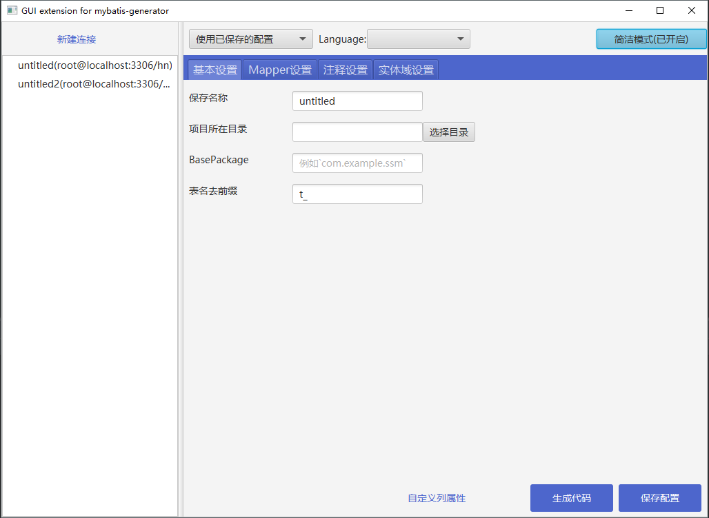

# mybatis-generator-gui-extension

<!-- Badges section here. -->

<!-- /Badges section end. -->

## 简介

**mybatis-generator-gui-extension**是一个为MybatisGenerator编写的图形化界面，为`实体`/`Example`/`Mapper`提供了丰富的扩展。

### [查看更多预览图片](./wiki/PREVIEW.md)      [English README](./wiki/README-en.md)

## 功能清单
- `文件合并`：在重新生成代码时，将保留没有添加`@mbg.generated`注释的字段/方法/SQL语句
    - 可合并的文件：`实体类`、`Example`、`Mapper.java`、`Mapper.xml`
- `自动包裹关键字`：对于表名/字段名为关键字的情况，可指定用 ` 或其他字符串包裹，防止冲突
- `实体类增强`
    - `rootClass`(可选)：可为实体对象指定RootClass
    - `trim`(可选)：为String类型的setter添加`trim`
    - `使用真实列名`(可选)：可指定是否使用真实列名
    - `流式构建`(可选)：直接使用`User user= new User().withUsername("uname").withPassword("123");`创建对象
    - `toString`(可选)：生成toString方法(可选择是否调用父类的`toString`方法)
    - `equals/hashCode` (可选)：生成`equals/hashCode` 方法（可选择是否调用父类的equals/hashCode 方法）
    - `Serializable`（可选）：继承`Serializable`接口
- `Example增强`
    - `CaseInsensitiveLike`：添加CaseInsensitiveLike查询方式
    - `ExampleCriteria增强插件`
    - `真实字段获取插件`
    - `分页插件`：提供基于limit/offset的分页。
- `Mapper增强`
    - `指定Mapper类型`：可选择`纯xml`/`java和xml混合`/`纯java`的方式生成mapper
    - `指定主键`：可指定表的主键，将会自动为该表生成获取自增主键的SQL
    - `虚拟主键`：
    - `逻辑删除`
    - `批量插入`
    - `添加@Mapper注解`
    - `各个方法的开关`
- `生成JPA注解`
- `指定类头注释`：自定义生成的文件的注释
- `缓存`：采用MBG官方的缓存插件，为生成的查询方法提供cache标签
- 指定BasPackage
- `对象重命名`：
    - `Example` 类的重命名
    - `实体` 类的重命名
    - `Mapper` 类的重命名
- `指定后缀`： 可修改如下项目的后缀：`dao包`、`实体包`、`Mapper`、`Example`、`实体`。
## 如何使用

> 运行前请确保您的JDK版本为1.8u40以上   
> 前三种方式需要先下载源代码

`源码运行`: 用IDE将源代码导入为Maven项目，然后直接运行`com.spawpaw.mybatis.generator.gui.GeneratorGuiRunner`即可  
`自助打包jar`: 执行 `mvn package`  
`自助打包exe` :  执行 `mvn package jfx:native`  
`直接下载jar包`: [选择版本进行下载](https://github.com/spawpaw/mybatis-generator-gui-extension/releases)   

## 二次开发 && 交流 ([进入帮助页面](https://github.com/spawpaw/mybatis-generator-gui-extension/wiki))

- 如果您开发了自己的MBG插件，只需几行代码便可将其暴露到图形界面中，无需了解整个项目的构造。（参见[四步将Plugin的配置暴露到图形化界面中](./wiki/IntegrationOfYourPlugin.md)）

如果您在使用过程中遇到了BUG，或者想让软件添加某些功能，请挂issue或者联系作者：<spawpaw@hotmail.com>

项目地址 https://github.com/spawpaw/mybatis-generator-gui-extension  
QQ交流群：171209016

## 贡献代码
#### 1.创建issue（工单）
在本项目的issue页，创建一个issue，描述你所要添加的功能。
#### 2.fork本仓库
将本仓库fork到你自己的账户，并将你的代码提交。  
#### 3.发起PR
提交完成后，你将会在你的仓库中看到`PullRequest`按钮，点击发起PR然后按照提示操作就可以了。

tips: 在commit时可以使用`#<issue-id>`来关联issue

## 其他
如果您觉得本软件对您有帮助，请别忘记给这个项目一个`star`   ο(=•ω＜=)ρ⌒★

#### 您的项目适合使用本工具吗？

先来看一下您的项目是否有如下需求：
- **需要根据表结构生成其他代码**：比如service、controller甚至是前端的代码。
- **要求对SQL高度可控**：DBA需要审查SQL脚本或需要使用自动化工具对**所有**SQL脚本进行检查。

如果有上面任意一项需求，那么使用本工具是没有任何问题的。
但是如果你追求快速的开发，简洁的代码，建议使用[Spring Data JPA](https://github.com/spring-projects/spring-data-jpa)、[mybatis-plus](https://github.com/baomidou/mybatis-plus) 、 [通用Mapper](https://github.com/abel533/Mapper)，
这些项目提供了更优雅的方式来实现简单的CRUD、Example查询，毕竟大部分项目在大部分情况下很少遇到手写复杂代码的情况，会触及性能问题的代码也很少（即使有也很容易定位），通过本工具生成的大量代码反而可能会给维护带来一定麻烦。

[捐赠](./wiki/donate.md) （[捐助者列表](https://github.com/spawpaw/mybatis-generator-gui-extension/wiki/sponsors)）

## 内推
有换工作意向的同学可将简历发送到如下邮箱:
|公司|邮箱|内推链接|职级及方向|
|:----|:----|:----|:----|
|阿里巴巴| shangbenben@alibaba-inc.com | [阿里巴巴/集团CTO线/CFO产品技术部 - 产品-平台型 P6-P7 杭州](https://talent.alibaba.com/off-campus-position/811942?trace=qrcode_share) [阿里巴巴/集团CTO线/CFO产品技术部 - Java高级开发工程师-财资技术 P5-P7 上海](https://talent.alibaba.com/off-campus-position/714176?trace=qrcode_share)   [阿里巴巴/集团CTO线/CFO产品技术部 - 高级测试开发工程师 杭州](https://talent.alibaba.com/off-campus-position/714174?trace=qrcode_share)    |P5~P7 产品、前后端、测试、Java开发； 集团CTO线财务方向可部门直推。也可内推其他部门。|
|字节跳动| chenwenhang@bytedance.com |https://job.toutiao.com/s/JGCe4nh||

- 邮件主题格式： `[内推][期望岗位方向][工作年限（从正式工作开始）] 姓名 电话` 例如：`[内推][Java开发][2年] 张三 13800000000`  
- 邮件内容： 可以写几句话介绍自己（比如有些限于篇幅不好写在简历里的，不写也行）。简历放在附件中，必须是pdf格式。
- 社招最好本科学历，基本功扎实，两年以上工作经验。如果过往成果显著，也可适当放宽要求。
- 可以直接在内推链接中投递；也可以先将简历发到邮箱，我们提供一些建议后再投递。
- 由于工作忙，可能会集中到晚上回复，望理解。

