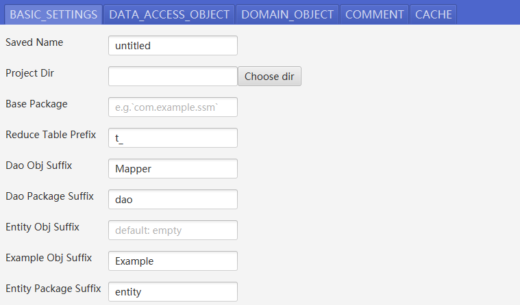
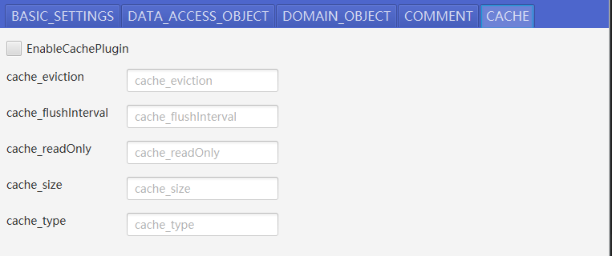
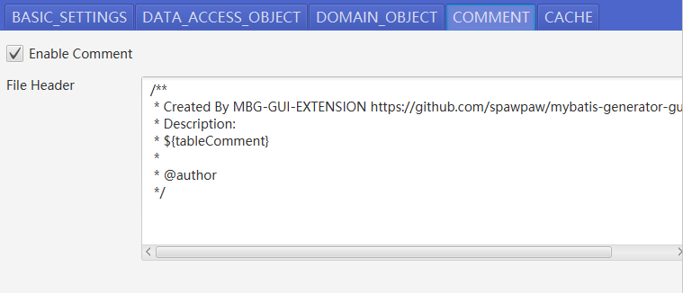
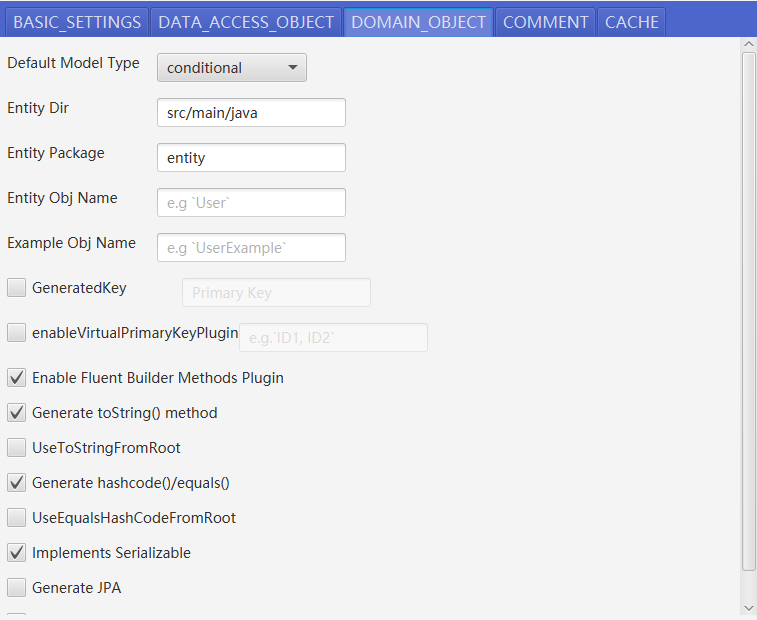
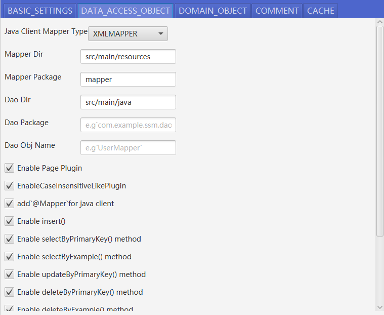
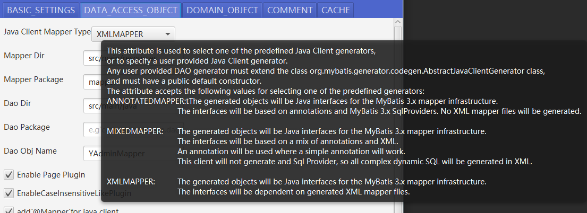
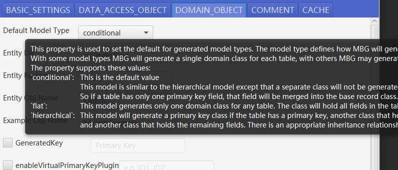
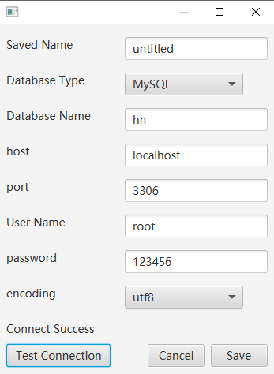
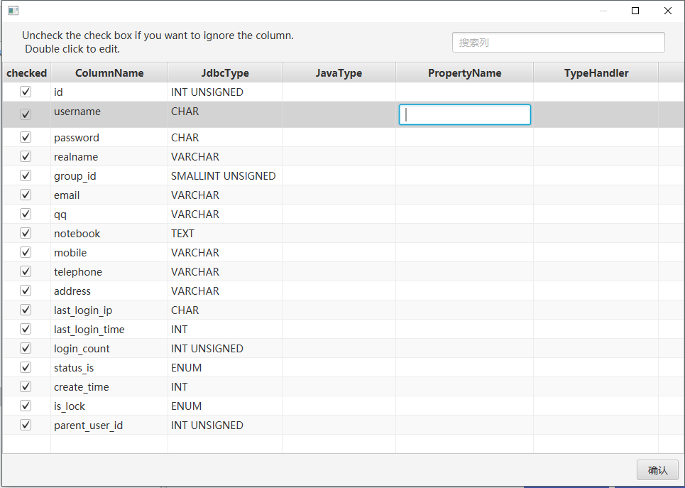

## Main Window

## Basic Settings

## Cache Settings

## Comment Settings

## Entity Related Settings

## Mapper Related Settings

## Tooltip while mouse over

## Create connection

## Customize Columns
